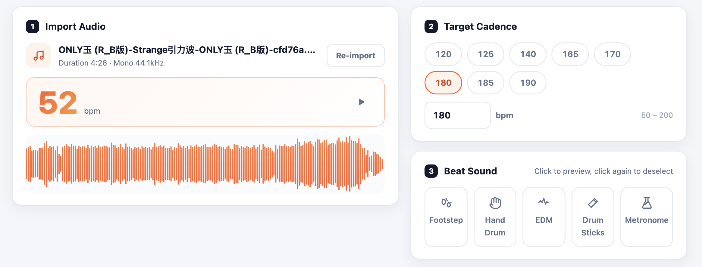
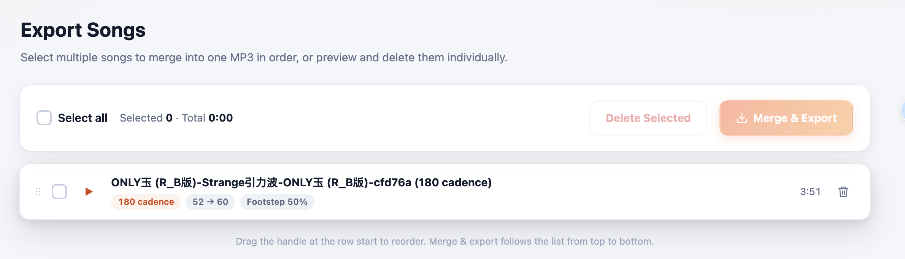
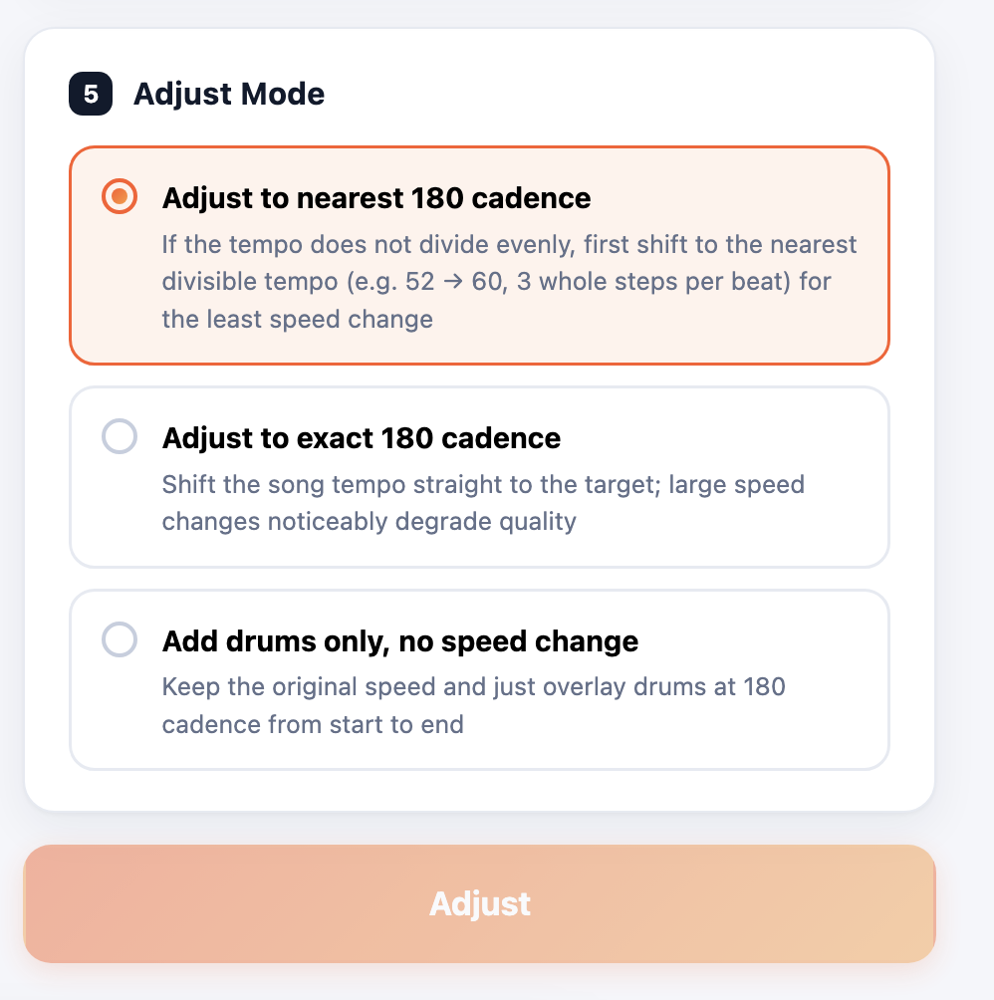

# 180 Running Music Editor

> Retune any song to your running cadence — 100% in your browser.

**180 Running Music Editor** detects the tempo of any song, time-stretches it to your
target running cadence (default 180 steps per minute, adjustable 50–200), overlays a
footstep or drum metronome, and exports a single merged MP3. The entire pipeline runs
locally in the browser — your audio is never uploaded to a server.

🌐 **Live demo:** https://m.zxxdb.com/ · 🗣️ Available in 10 languages

## Screenshots

| Editor | Batch export | Adjust mode |
|--------|--------------|-------------|
|  |  |  |

## Why this exists

Most music isn't at 180 SPM, so its beat fights your stride. This tool time-stretches
any track to your cadence and lays a footstep or drum metronome on top, so your playlist
finally matches your feet — without you having to hunt for "running remix" playlists.

## Features

- **Auto BPM detection** — drop in a track and the tempo is measured on import.
- **Cadence-accurate time-stretch** — target 50–200 SPM (presets: 120 / 140 / 165 / 170 / 180 / 190).
- **Five beat sounds** — footstep, hand drum, EDM, drum sticks, metronome, mixed at a
  volume relative to the song.
- **Two stretch modes** — *nearest cadence* (smallest tempo shift, beats stay aligned to
  the cadence) or *exact cadence*; or drums only, with no speed change.
- **Merge & export** — combine several tracks in order into one 128 kbps mono MP3.
- **10 languages** — English, 中文, 繁體中文, 日本語, 한국어, فارسی, العربية, Français, Deutsch, Русский.
- **100% local** — Web Audio + WebAssembly; no server, no upload, no account.

## How it works

The whole pipeline — decode, stretch, mix, encode — happens in the tab.

### 1. Tempo detection

We decode the file to PCM with the Web Audio API, run onset detection, and estimate the
global BPM with autocorrelation, then snap to the nearest musically plausible value
(most songs sit in a narrow BPM band; we disambiguate octave errors by preferring the
tempo whose beat grid best fits the detected onsets).

### 2. Pitch-preserving time-stretch

Naive resampling changes pitch. Instead we use a **WSOLA** (Waveform Similarity
Overlap-Add) overlap-add with an adaptive similarity search: segments are overlapped and
the best-aligned continuation is chosen, so the song keeps its key while the tempo
changes. To keep the metronome grid aligned to your feet, *nearest cadence* mode picks the
smallest stretch factor that makes beats divide evenly into your cadence.

### 3. Beat synthesis

The click track is synthesized with Web Audio (oscillators and pre-rendered samples for
footstep / hand drum / EDM / drum sticks / metronome) and mixed at a user-controlled gain
relative to the song loudness.

### 4. In-browser MP3 export

The final mix is encoded to MP3 **in the browser** with `lamejs` (a JS/WASM port of LAME).
No audio ever leaves the device — which is also why there is no backend to pay for.

## Privacy

No accounts, no uploads, no file access from outside the tab. The audio graph lives
entirely in your browser session.

## Internationalization

All localized pages are statically pre-rendered, each with its own `canonical` URL and a
full set of `hreflang` annotations (including `x-default`), so every language is
independently indexable by search engines rather than served from one JavaScript-swapped
page.

## Tech stack

- **Web Audio API** — decoding, time-stretch, mixing
- **WSOLA** — pitch-preserving time-stretch
- **lamejs** — in-browser MP3 encoding
- **Vanilla JS + a small i18n layer** — no UI framework

## License

This repository is a showcase for the live tool at <https://m.zxxdb.com/>. The full
application source is not included here. See `LICENSE` for usage terms.
